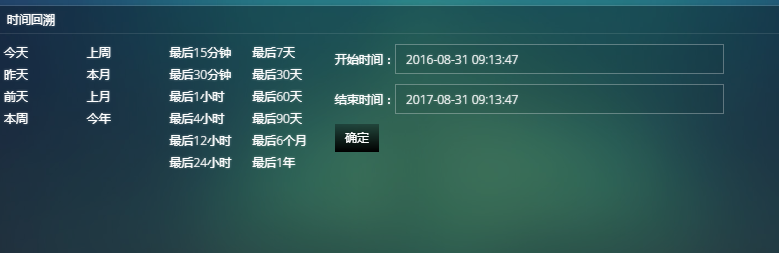
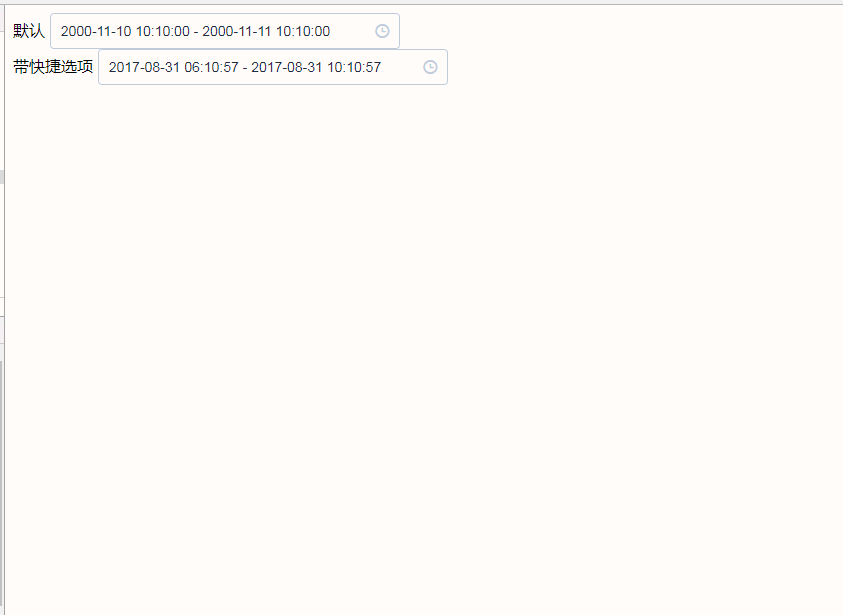

# vue日期控件vuedateTimePicker

为解决项目中的这种业务需求gfgfdgfdgfdg



故引入vue日期控件 效果如下



all code:
```
<!DOCTYPE html>
<html lang="en">
<head>
    <meta charset="UTF-8">
    <title>vuedateTimePicker</title>
    <!-- 引入样式 -->
    <link rel="stylesheet" href="css/vueIndex.css">
</head>
<body>
<div id="app">
    <template>
        <div class="block">
            <span class="demonstration">默认</span>
            <el-date-picker v-model="value3" type="datetimerange" placeholder="选择时间范围">
            </el-date-picker>
        </div>
        <div class="block">
            <span class="demonstration">带快捷选项</span>
            <el-date-picker v-model="value4" type="datetimerange" :picker-options="pickerOptions2" placeholder="选择时间范围" align="right">
            </el-date-picker>
        </div>
    </template>
</div>
</body>
</html>
<script src="js/vue.js"></script>
<!-- 引入组件库 -->
<script src="js/vueIndex.js"></script>
<script>
    var Main = {
        data() {
            return {
                pickerOptions2: {
                    shortcuts: [
                        {
                            text:"最后15分钟",
                            onClick(picker) {
                                const end = new Date();
                                const start = new Date();
                                start.setTime(start.getTime() - 15*60 * 1000);
                                picker.$emit('pick', [start, end]);
                            }
                        },
                        {
                            text:"最后30分钟",
                            onClick(picker) {
                                const end = new Date();
                                const start = new Date();
                                start.setTime(start.getTime() - 30*60 * 1000);
                                picker.$emit('pick', [start, end]);
                            }
                        },{
                            text:"最后1小时",
                            onClick(picker) {
                                const end = new Date();
                                const start = new Date();
                                start.setTime(start.getTime() - 3600 * 1000);
                                picker.$emit('pick', [start, end]);
                            }
                        },{
                            text:"最后4小时",
                            onClick(picker) {
                                const end = new Date();
                                const start = new Date();
                                start.setTime(start.getTime() - 3600 * 1000*4);
                                picker.$emit('pick', [start, end]);
                            }
                        },{
                            text:"最后12小时",
                            onClick(picker) {
                                const end = new Date();
                                const start = new Date();
                                start.setTime(start.getTime() - 3600 * 1000*12);
                                picker.$emit('pick', [start, end]);
                            }
                        },{
                            text:"最后24小时",
                            onClick(picker) {
                                const end = new Date();
                                const start = new Date();
                                start.setTime(start.getTime() - 3600 * 1000*24);
                                picker.$emit('pick', [start, end]);
                            }
                        },{
                            text: '最后一周',
                            onClick(picker) {
                                const end = new Date();
                                const start = new Date();
                                start.setTime(start.getTime() - 3600 * 1000 * 24 * 7);
                                picker.$emit('pick', [start, end]);
                            }
                        },{
                            text: '最后30天',
                            onClick(picker) {
                                const end = new Date();
                                const start = new Date();
                                start.setTime(start.getTime() - 3600 * 1000 * 24 * 30);
                                picker.$emit('pick', [start, end]);
                            }
                        },{
                            text: '最后60天',
                            onClick(picker) {
                                const end = new Date();
                                const start = new Date();
                                start.setTime(start.getTime() - 3600 * 1000 * 24 * 60);
                                picker.$emit('pick', [start, end]);
                            }
                        },{
                            text: '最后90天',
                            onClick(picker) {
                                const end = new Date();
                                const start = new Date();
                                start.setTime(start.getTime() - 3600 * 1000 * 24 * 90);
                                picker.$emit('pick', [start, end]);
                            }
                        },{
                            text: '最后6个月',
                            onClick(picker) {
                                const end = new Date();
                                const start = new Date();
                                start.setTime(start.getTime() - 3600 * 1000 * 24 * 30*6);
                                picker.$emit('pick', [start, end]);
                            }
                        },{
                            text: '最后1年',
                            onClick(picker) {
                                const end = new Date();
                                const start = new Date();
                                start.setTime(start.getTime() - 3600 * 1000 * 24 * 30*12);
                                picker.$emit('pick', [start, end]);
                            }
                        },/*{
                         text:"今天"
                         },{
                         text:"咋天"
                         },{
                         text:"前天"
                         },{
                         text:"本周"
                         },{
                         text:"上周"
                         },{
                         text:"本月"
                         },{
                         text:"上月"
                         },{
                         text:"今年"
                         },*/{
                            text:"zhanwei"
                        }]
                },
                value3: [new Date(2000, 10, 10, 10, 10), new Date(2000, 10, 11, 10, 10)],
                value4: ''
            };
        }
    };
    var Ctor = Vue.extend(Main);
    new Ctor().$mount('#app')
</script>
```

